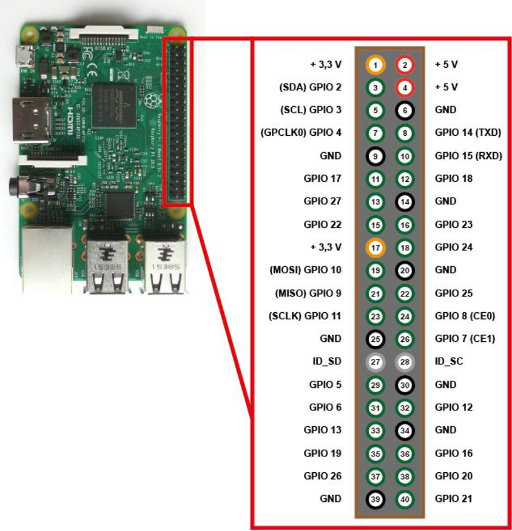

# Raspi to Light

## 1. Projekttreffen
* Starter-Treffen mit Informationen zum Projekt(ablauf)

## 2. Projekttreffen — 4. April 2019

* Cross-Compilation möglich (Multichain), muss also nicht auf dem Pi gemacht werden (Erstes GOogle-Ergebnis: "raspberry pi eclipse c++)
* STFT in C++ Beispiel: https://stackoverflow.com/questions/31475842/getting-values-for-specific-frequencies-in-a-short-time-fourier-transform
* CMake soll genutzt werden (IDE und OS Uabhängigkeit, Tutorial wird noch in Moodle bereitgestellt)
* GitLab Runner installieren (außerhalb der Sitzung) für GitLab CI (Server benötigt, Docker Anleitungen gibt es zu Hauf)
* Qt mit Widgets soll genutzt werden (GUI)
* Kommunikation via WhatsApp

* Aufgabenverteilung
  * Oberfläche (mit Qt / MIIP)
    * Player-Verwaltung (Jens Dolfus)
    * Fixture-Verwaltung (Sebastian Rindfleisch)
    * Edit-Ansicht (Beide)
  * SigV
    * Einlesen Audisignal
    * Abtastung Audiosignal
    * Algorithmus STFT (Steven Drewers)
    * Mapping Audio/Licht (Johannes Hirth)
  * I/O
    * DMX Hardware Ausgabe / GPIO (Johannes Hirth)
    * Datei-Handling / Speichern & Laden von Shows (Fabian Krüger)
  * Bonus
    * GPIOs nutzen, Extension Board bauen, UART-DMX (Steven Einkaufsliste)
  * Entwicklungsumgebung aufsetzen (erste Aufgabe / MIMP)
    * Aufsetzen
    * Tutorial

## 3. Projekttreffen — 11. April 2019

* Allgemeines:
    * Anfragen zur Aufnahme von Dateien/Links/etc die ins Moodle aufgenommen werden sollen [hier stellen.](https://moodle.medien.hs-duesseldorf.de/mod/forum/view.php?id=4588)
    * Git Issues verwenden

* Hardware
    * Hardware für Ausgabe über GPIO anschaffen
        * 5V Ports für Ausgabe benutzen 
 
        * Herrn Emmerich nach vorhandenen Bauteilen fragen, ansonsten bestellen
        * Board bauen lassen oder DMX Interface FT24RL bestellen ([BitWizard_B.V.](http://bitwizard.nl/shop/DMX-interface-for-Raspberry-pi-with-usb-(FT245RL)))
        * Eventuell vorher zunächst provisorisch selber bauen
        * Schaltplan und Teileliste an Herrn Antes

* Software
    * bei Git Commits betroffenen Issue verlinken
    * C++ 11 verwenden
    * Bei Verwendung von Librarys auf Kompatibilität achten
    * Einheitlichen Coding Style benutzen: [Google C++ Style Guide](https://google.github.io/styleguide/cppguide.html)
        * Stylechecker zu prüfen verwenden
    * Komentare/DocGenrator benutzen
        * für jede Methode zum Mindest eine kurze Erklärung
        * Algorithmen ausführlich Kommentieren
    * Variablen und Kommentare/Doc einheitlich auf Englisch
    * Funktionssammlung im Wiki bereitstellen
    * Ubuntu Mate auf den Raspberry Pi's installieren

    * GUI Elemente in relativer Größe
    * QT Anwendung kompilieren
        * Mindestanforderung:
            * für Raspberry Pi 3b+ (64Bit)
        * Außerdem:
            * jeweils 32 und 64 Bit Versionen für den Raspberry Pi
            * jeweils 32 und 64 Bit Versionen für Windows
            * 64 Bit Version für Mac

    * Audio Dateiformate zu WAV umwandeln, speichern und der Signalverarbeitung zur Verfügung stellen
        * Abspeichern der zum Track zugehörigen Lightshows
        * Abspeichern der aktiven Fixtures
        * Abspeichern der Playlist (.m3u)

* Signalverarbeitung
    * Signal im Original-Zustand belassen (Stereo)

* Algorithmus
    * [Essentia Library](https://essentia.upf.edu/documentation/) verwenden
    * Mehr als reine Equalizer Visualisierung, zum Beispiel:
        * Harmonie-Änderungen
        * Licht-Akzente
        * Beat
        * Templates für den Nutzer
            * Stimmung
            * Genre
            * "Danceability"
## 4. Projekttreffen — 18. April 2019

* Erster Entwurf der GUI wurde vorgezeigt
* Waveformplot als Option für eine Darstellung des Songs
* Bootstrap als Designvorlage vorgeschalgen
* Gitignore und Cmake optimiert für den GUI Branch
* Als Docx Generator soll Doxigen genommen werden.
* Quickdocumentation bevorzugt für Kommentare
* Erstes Programm wurde versucht auf dem PI zu kompilieren, dieser stürzt dabei allerdings ab.
* Dynamisches linken von QT Librarys ist Problematisch.

* Algorithmusbesprechung:
    * Essentia kann nicht genutzt werden, da es zu Umfangreich ist.
    * QTMedia könnte benötigte librarys haben, welche auf den Waveformplot machen könnten.

* Logik:
    * SFTW3 soll als standardlibrary genutzt werden.
    * float ist der Standard beim Auslesen und Speichern der Werte.
    
    * Aus Datei benötigte Infos:
        * Aus dem Zeitbereich, Peaks betrachten.
        * Frequenzinformationen, Spektogramm (dafür den sftw3)
* Probleme und deren Lösungen bei FFT:
    * Ergebnisse der Transformation können verfälscht sein. Diese müssen ausgeglichen werden.
    * Für die Lichtsteurung, will man wissen wann welche Frequenzen vorkommen. Signal in Blöcke unterteilen, darauf analyse starten.
    * Hammingfenster wird für FFT benutzt.
    * Größe der Überlappung von Fenstern muss für unsere Bedürfnisse angepasst werden. Stadardwert für den Anfang 50% Überlappung
    * Grober Ablauf:
        * Man geht über jeden Block, macht die Fensterung, macht die FFT. Fertig. Danach weiß man welche Frequenzen für welchen Block vorhanden sind.

* Aufgabenverteilung:
    * Medientechniker widtmen sich dem Algorythmus, BMI verbessert die GUI.
    * Anforderungen an GUI können über Git geadded werden.

## 5. Projekttreffen — 02. Mai 2019
In der letzten Woche geschafft:
* Automatisches Builden auf Jans Pi in Kombination mit GitLab funktioniert
* Fixtures können in der Fixture-Ansicht hinzugefügt werden
* fftw3 und libsndfile können mit Hilfe eines Skripts auf Linux, Mac und Windows für den Pi kompiliert werden
* STFT läuft (time ranges mit frequency ranges, an jedem Zeitpunkt die Frequenz)

Für die nächste Woche steht an:
* Wenn .mp3 geliefert wird, Umwandlung in .wav
* Zusammenführen von branches (library-Einbindung und aktueller GUI-Stand)
* STFT endet momentan mit einem großen Array. Dazu sollen noch "getter"-Funktionen geschrieben werden, die bestimmte gewünschte Dinge aus diesem Datensatz auslesen
* Header/DLL in Projekt einbinden, um Vellemann VM116 anzusteuern (Daten an spezifischen Channel schicken)
* Zwischenziel: In der GUI existiert ein Button, um die STFT mit der eingelesenen Datei durchzuführen. Weiterer Button, um random Werte auf XLR-Channel zu schreiben.

## 6. Projekttreffen — 09. Mai 2019

STFT: Ausgabe nicht in Funktionswerten, sondern im Bereich 0-256.

-erster Test der Lampen(Datenübertragung). 

STFT: Festlegung der Zeitabstände für die Übertragung von Signalen an die Lampe 
 (idealerweise 0.5). 

-Probleme beim Ausführen in Linux (Fehler mit libraries).

!!!!AUFGABE: Bis nächste Woche versuchen zum Laufen zu kriegen!!!! 

-Wie werden Daten übergeben ? (XML-Datei mit Speichern und Auslesen oder direkt verarbeiten?)

-Austesten mit dem PI(Johannes) 

STFT: 2205 windowsize damit dann 25ms steps ( für 40 Werte die Sekunde) 

-merged STFT+GUI in Struktur mit dem Masterbranch 

GUI:

-noch keine USB-Ausgabe
-Probleme mit QT(crasht), Variante funktioniert
-Anzeigen der Spuren klappt noch nicht so ganz 

Ziel: Slider zum Laufen kriegen, danach Spuren und Ansicht.

!!!Augabe(?): GUI mit den Funktionen der Klasse STFT verbinden(Nicht unbedingt bis nächste Woche)!!!

STFT : Wie klappt eine vernünftige universelle Beat Detection ? 
-Lampen müssten nach den Schlägen faden. 
-Bei 40 Schlägen könnte das egal sein. 

WICHTIG: Alle arbeiten auf der gemerged Version 
	 Bugs bis nächste Woche beheben 

## 8. Projekttreffen — 23. Mai 2019

* Roadmap
  * Was soll Inhaltlich geliefert werden?

* Effekte
  * Lightshow Effekte abhängig vom Genre
  * Effekt Sammlung als Library/Liste
  * BPM auf Effekte anpassen
   
  * der Nutzer soll an der stelle der pausierten Wiedergabe für das aktive Fixture-Effekte einfügen (welcher Effekt, Farben, Frequenzen, dauer)

* Generierte Lightshow
  * Farbwechsel (Strophe, Refrain, Lautstärke)
  * Anzeige stark reduzieren
  * Löschen/Ausblenden über bestimmte Zeit

* Editierte Lightshow-Inhalte kennzeichnen (Rollback)

* GUI Wave-Form-Plot

* Beat detection über einfachen Algorithmus

## 10. Projekttreffen — 13. Juni 2019
Stand: 
- waveform-plot für GUI kommt nicht
- Pi crasht bei Play

Baustellen:
- Pi soll Sound abspielen und Pi soll Lightshow abspielen. Jeweils minimal working example

## 12. Projekttreffen — 04. Juli 2019
* Projektabgabe:
Doku Technisch, nicht für Nutzer
Präsi ca 7 Min -> Was wurde gemacht. Bilder und oder Codeschnipsel
Fachliche Fragen am Ende

* Bestellte Gegenstände:
Pro DMX Kabel (Eurolite USB DMX 512 Pro)
Raspi Touchscreen 7”
Moving Head bestellt (ADJ Inno Pocket Spot).
Bewegung wird nicht erwartet, Licht schon.

* Anforderungen an die GUI bis nächste Woche:
Crash der Edit Fixture bei Änderung des Type.
Functions richtig füllen.
Wenn Fixtures geändert wurden und der Stacked Widget auf Playview wechselt, Abfrage ob Lightshow neu generiert werden soll.

* Merge Probleme bei der Playlist. Code muss revertet werden.

* Song.cpp sollte im Core bleiben, da QT nicht genutzt werden soll.
Wenn User Song hinzufügt soll: Genre und Hauptfarben ausgewählt werden (5 Vorgegebene Farben)

* Core:

Mate auf PI installiert. Minimal Version von Player implementiert. Sound kommt. Klingt immer noch komisch. Vermutung, dass beim Abspielen falsches default Audiodevice genommen wird. Deviceindex wird mit -1 ausgegeben. Andere Library bringt gleichen Fehler. Vermutlich Betriebssystemfehler.

* Analyse
Beatdetection funktioniert. Time to Say goodbye ist ¾ und Variables Tempo = BÖSE.
Es wird nur noch 1 Band geprüft 0 - 1500 Hz und über 1 Sek
BPM von 60 - 200 geprüft. Analyse Von 11 Min auf 15 Sek runter.
Für 8 Beats (2 Takte) FFT -> Intensität des Songs.
Segmentieren, Beatdetection, Frequenz, Energie -> Möglich
ca 20 Sek für Analyse auf älterem PC.

Values für die nächsten 2 Takte. Bis dato sind Values noch Random.
Unterster Bereich Ambient.

Man kann Spektrum über den Song laufen lassen um Farbe finden zu lassen.

* Lightshow & DMX-Device
QXML auf tinyxml2 geändert für Lightshows.
Länge und Auflösung auslesbar. 3 Sekunden bei Lenght mehr um abschalten der Lampen am Ende eines Songs zu gewährleisten.
Non-Pro DMX Kabel genutzt. Treiber fehlt.64 byte pro schreibvorgang schreibbar.
Mit Prokabel wird libftdi benötigt. Mit Libusb nicht zu öffnen.
ZADIG installiert Treiber für libusb-Geräte. Klappt auch nicht ganz. Prokabel sollte diese Probleme lösen.
Rapsberian soll OS werden für das entwickelt wird, weil performant.

Ein Song generiert immer die gleiche Lightshow.

Lightshow: Colorfade noch nicht implementiert.

MP3 Konvertierung noch nicht implementiert. -> Idee LAME Encode.

* 3 neue Lieder freigeschaltet.