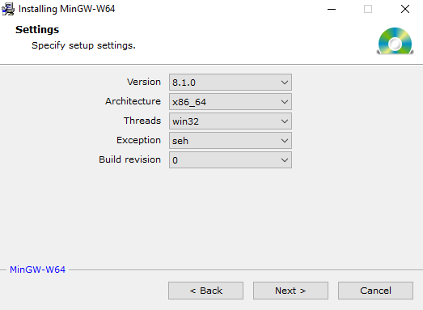
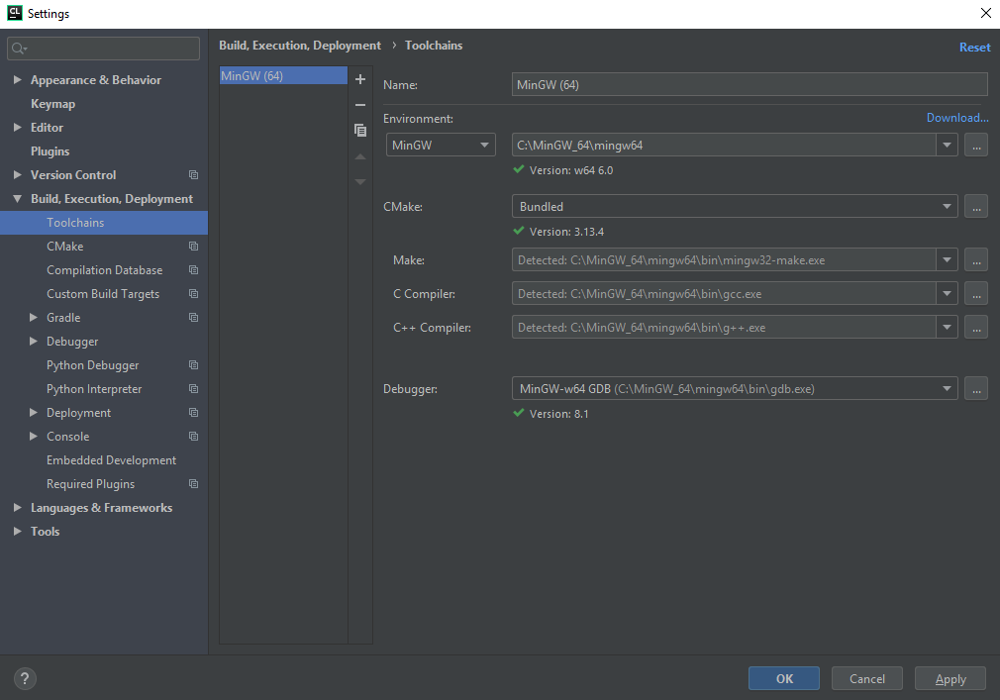
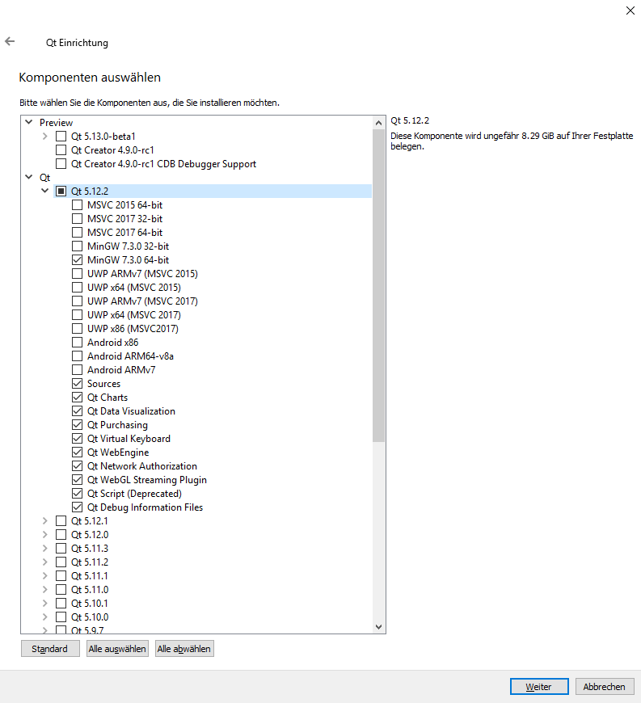
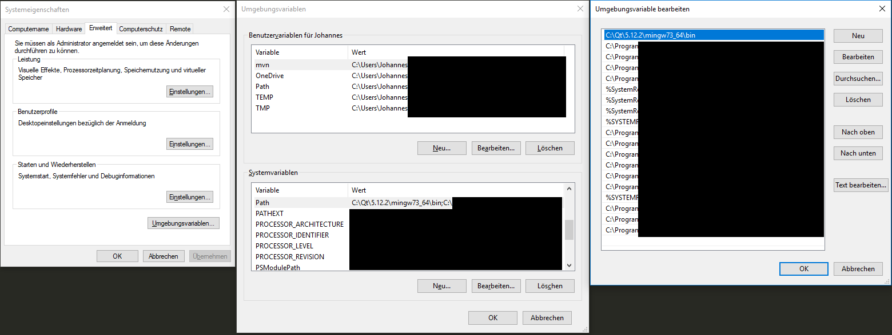
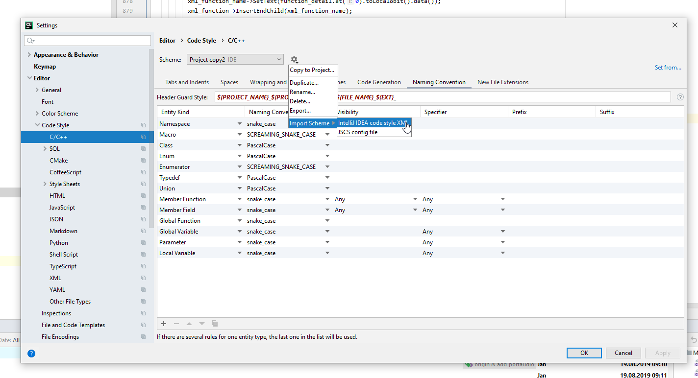
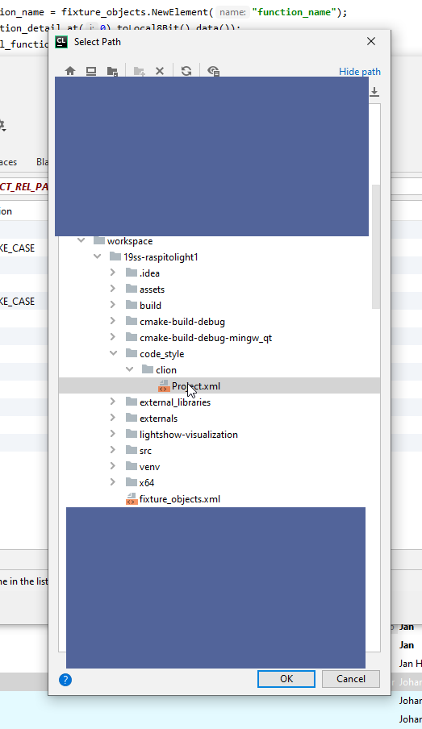
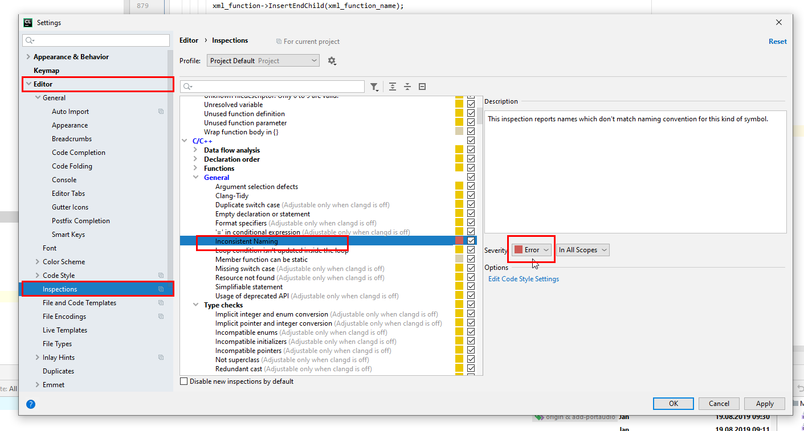

Um das Projekt auf dem eigenen PC bearbeiten zu können müssen mehrere Dinge getan werden.

Zunächst muss [CMake](https://cmake.org/download/) installiert werden. Die verwendete Version in diesem Projekt ist 3.14.1 für 64-bit (Generell ist bei allen Einstellungen im gesamten Projekt die 64-bit-Variante zu wählen).

Auf Windows-Systemen muss dann noch [MinGW-W64](https://mingw-w64.org/doku.php/download/mingw-builds) installiert werden. Der Installationspfad kann deutlich verkürzt werden und beispielsweise "C:\MinGW_64" lauten. Bei der Installation sind die Einstellungen wie im unten stehenden Bild zu wählen.


Falls auf dem lokalen System noch kein git installiert ist, ist dies zu tun.

Dann muss gegebenenfalls noch der SSH-Key für GitLab generiert werden. Dies geht [hier](https://projectbase.medien.hs-duesseldorf.de/profile/keys) und eine Anleitung dafür befindet sich [hier](https://projectbase.medien.hs-duesseldorf.de/help/ssh/README#generating-a-new-ssh-key-pair).

Um zu testen, ob die installierten Tools funktionieren, können folgende Kommandos auf der Konsole ausgeführt werden:

```shell
g++ --version
```
```shell
git --version
```
```shell
cmake --version
```
Keines dieser Commands sollte auf der Kommandozeile einen Fehler produzieren.

CLion wird in der Version 2019.1 verwendet. Unter Windows muss für CLion nun die Toolchain auf MinGW-W64 eingestellt werden. Dies geht unter File > Settings > Build, Execution, Development. Dort ist eine Toolchain mit den Einstellungen wie im Bild hinzuzufügen.


Qt wird in der kostenlosen Open Source-Variante installiert. Beim Installieren kann das Login-Fenster geskipt werden. Der präferierte Installationspfad unter Windows lautet "C:\Qt". Danach muss Qt in der Version 5.12.2 ausgewählt werden. Vermutlich reicht es, den Unterpunkt "MinGW 7.3.0 64-bit" und alle Unterpunkte von "Sources" abwärts auszuwählen. Das muss aber noch bestätigt werden, bisher wurde immer noch einiges mehr installiert.


Nun muss CMake der Pfad zur Qt-MinGW-Installation gezeigt werden. Das geht garantiert auch schöner, aber aktuell ist die einzige Lösung, diese Zeile einmal in die oberste CMakeLists.txt hinzuzufügen und nach dem ersten Builden wieder rauszulöschen (Pfad natürlich an lokale Installation anpassen und auf doppelte Backslashes achten).
`set(CMAKE_PREFIX_PATH "C:\\Qt\\5.12.2\\mingw73_64")`

Unter Windows muss nun noch der Pfad "C:\Qt\5.12.2\mingw73_64\bin" zur Systemumgebungsvariable "Path" hinzugefügt werden. Dies geht unter <Windows-Taste> > Systemumgebungsvariablen bearbeiten > Umgebungsvariablen > (im unteren Teil) Path doppelklicken > Neu. **Wichtig** hierbei ist es, den neu hinzugefügten Teil von Path ganz nach oben bzw. vorne zu verschieben!


Auf dem gleichen Wege muss unter Windows der Pfad "C:\MinGW_64\mingw64\bin" zur Systemumgebungsvariable "Path" hinzugefügt werden. Dieser Pfad muss allerdings nicht zwingend nach ganz vorne bzw. oben geschoben werden.

## Code style checks in Clion einrichten:
Für Clion gibt es eine Code Style XML, die wiefolgt in CLion importiert werden kann:
Settings öffnen über File -> Settings oder STRG + ALT + s



In den Settings navigiert man zum entsprechenden Dialog über Editor -> Code Style -> C/C++. Unter dem Zahnradsymbol kann man dann Import Scheme -> Intellij IDEA code style xml auswählen. Unsere Code Style XML befindet sich im Ordner Code Style



Per default sind in Clion keine Checks für eine nach unserem Code Style korrekte Benennung aktiviert. Diese können unter Editor -> Inspections -> C/C++ -> General -> Inconsistent Naming aktiviert werden. Die Severity ist auf Error zu stellen. Nicht dem Code Style entsprechende Namen können so einfach über ALT + Enter korrigiert werden.


### Automatische Code Formatierung
Ist der Code Style korrekt in Clion eingerichtet, so kann der Source Code automatisch mit STRG + ALT + L formatiert werden. Auf diese Weise wird der Source Code immer gleich formatiert und ist immer konsistent. Auf diese Weise ist es viel einfacher, fremden Code zu lesen. Es ist davon abzusehen, gegen diese automatische Formatierung anzuarbeiten

