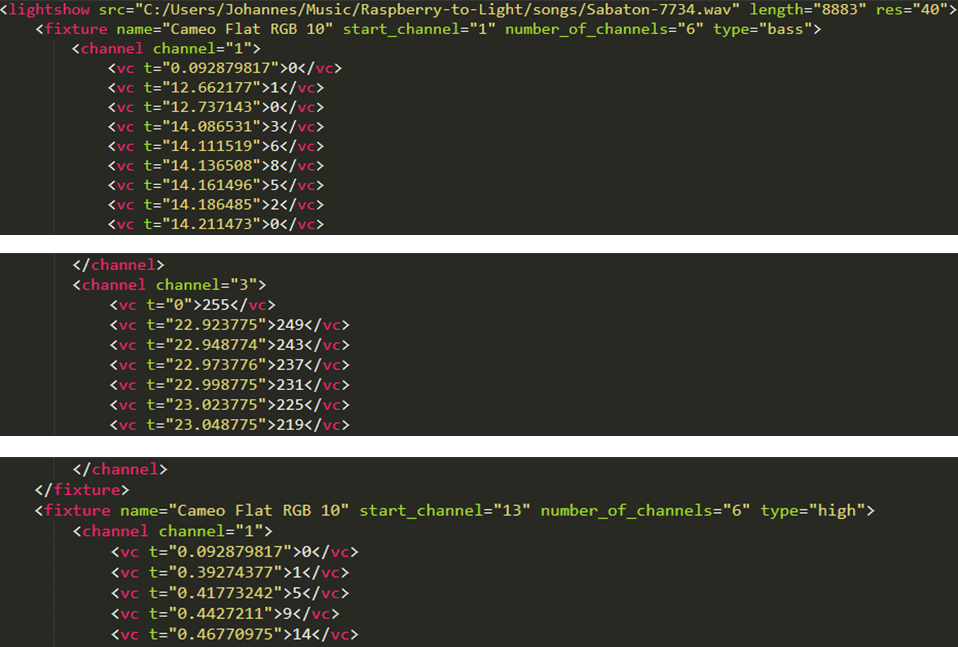

# Klassen rund um eine Lightshow

## Lightshow
Eine Lightshow besteht aus 
* der Angabe ihrer zugehörigen Sounddatei
* ihrer Länge in Sekunden * Änderungen pro Sekunde + 3
* ihrem höchsten verwendeten DMX-Channel
* einem Vector mit all ihren Fixtures

## Fixture
Ein Fixture besteht aus
* seinem DMX-Start-Channel
* seinem Namen
* seinem Typen (z.B. Bass, Action, ...)
* der Anzahl seiner Channel
* den Angaben, der wievielte Channel die Channel für den Dimmer sowie die Farben Rot, Grün und Blau innerhalb des Fixtures sind
* einem Vector mit all seinen Channels

## Channel
Ein Channel besteht aus
* seinem Channel innerhalb eines Fixtures
* einem Vector mit all seinen ValueChanges

## ValueChange
Ein ValueChange besteht aus
* seinem Zeitpunkt
* einem Wert zwischen 0 und 255.

# Generierung einer Lightshow
Für eine Lightshow müssen Fixtures angelegt werden. Abhängig von den Typen dieser Fixtures werden ihnen eine Farbe sowie aus spezifischen Frequenzbereichen generierte ValueChanges auf dem Dimmer-Channel hinzugefügt. Danach werden die Fixtures einem Lightshow-Objekt hinzugefügt. Für die Frequenzbereichanalyse wird die Klasse Analysis verwendet. Die daraus resultierenden Werte werden durch weitere Funktionen gegebenenfalls noch angepasst. So können diese zum Beispiel mit variabler Fenstergröße geglättet werden (siehe Klasse BoxFIR), um große Helligkeitssprünge und Flackern zu verhindern. Desweiteren können Werte generalisiert werden. So werden durch Angabe einer unteren Grenze, einer oberen Grenze und eines einheitlichen Werts alle ChangeValues innerhalb dieser Grenzen auf den einheitlichen Wert angepasst. Damit kann man eine (stark) reduzierte Anzahl an Helligkeitsänderungen erreichen. Nach der Generierung wird eine Lightshow für ihren Song in der LightshowRegistry registiert.

# Persistierung von Lightshows
Die Klasse LightshowRegistry dient dazu, eine Verbindung zwischen Songs und deren Lightshows herzustellen. Dafür enthält sie eine Map mit Songs als Key und Lightshows als Value. Songs und Lightshows werden in dieser Map allerdings nicht in Objektform repräsentiert, sondern ein Key ist der Name der Song-Datei und der Value ist der absolute Pfad inklusive Dateiname der Lightshow-XML-Datei.

Dafür existieren im von der Anwendung erstellten Raspberry-to-Light-Ordner zwei Unterordner: songs und xml-lightshows. Jeder hinzugefügte Song wird in den Ordner songs kopiert. Dadurch können Lieder von einem USB-Stick zur Anwendung hinzugefügt und der Stick im Anschluss wieder entfernt werden. Die Lightshows werden in XML-Dateien im Ordner xml-lightshows geschrieben. Dies geschieht mit Hilfe der Bibliothek tinyxml2. Dabei wird die Struktur der Objekte innerhalb eines Lightshow-Objekts beibehalten: Root-Element in einer XML-Datei ist immer \<lightshow\>. Darunter befinden sich verschachtelt entsprechend eine variable Anzahl von \<fixture\>, \<channel\> sowie \<vc\> (ValueChange).

* \<lightshow\> beinhaltet den Pfad zur Sound-Datei, auf die sich diese Lightshow bezieht, die Länge (Länge in Sekunden * Änderungen pro Sekunde + 3) und die Auflösung der Lightshow, also die Anzahl der Änderungen pro Sekunde.
* Jedes \<fixture\> beinhaltet seinen Namen, seinen Start-Channel, die Anzahl seiner Channel sowie seinen Typen.
* Jeder \<channel\> beinhaltet seinen Channel innerhalb seines Fixtures.
* Jeder \<vc\> beinhaltet seinen Zeitpunkt in Sekunden als Attribut und seinen Wert (0-255) als Text.

Durch die menschenlesbare und leicht editierbare Persistierung können mit geringem Aufwand händische Änderungen an generierten Lightshows vorgenommen werden.

# Abspielen einer Lightshow
Wenn ein Lied samt Lightshow abgespielt werden soll, wird in der LightshowRegistry für den aktuellen Song die entsprechende Lightshow-Datei herausgesucht. Diese wird dann eingelesen und dabei die hierarchische Struktur aus Objekten wieder hergestellt.

Dann wird aus der hierarchischen Anordnung der Objekte eine zeitliche Anordnung aller ValueChanges erstellt. Dafür wird ein 2D-Vector der Länge "Länge des Liedes in Sekunden * Änderungen pro Sekunden + 3" erstellt. Jedes Element ist wiederum ein Vector mit 512 Elementen. Diese stellen die 512 DMX-Channel dar. Nun wird jeder ValueChange an der zeitlich richtigen Stelle in den entsprechenden Channel eingetragen. Dann beginnt das Lied und zeitlich richtig getimet (usleep(25000)) wird der entsprechende 512-Elemente-Vector in einen Vector kopiert. Wie die Werte mit Hilfe einer Referenz auf diesen Vector ihren Weg zu den Lampen finden wird im nächsten Abschnitt erklärt.

# Kommunikation zwischen Anwendung und K8062

Bei der Umsetzung der Kommunikation zwischen Anwendung und K8062 wurde eine von Velleman veröffentlichte Test-Anwendung als Vorlage genommen. In der Test-Anwendung wird ein separater Prozess gestartet, der durchgehend einen Shared Memory ausliest und diesen über USB an das K8062 schickt. Aufgrund der Vorgabe, dass kein zweiter Prozess gestartet werden darf wird dies in unserer Anwendung mit einem Thread gelöst. Die von Velleman veröffentlichten Dateien eigneten sich auch nur zur Nutzung unter Windows. Unser Ansatz ist unabhängig vom Betriebssystem und funktioniert unter Windows, Linux und macOS.

Wenn ein Lied mit seiner Lightshow abgespielt werden soll wird ein Thread gestartet. Diesem werden eine Referenz auf einen std::vector mit 512 Integern und eine Referenz auf eine bool lightshow_playing übergeben. Solange die Variable lightshow_playing true ist schickt die Methode in dem Thread durchgehend den Inhalt des Vectors mit Hilfe der Bibliothek libusb an das K8062. Sobald lightshow_playing vom Hauptthread aus auf false gesetzt wird beendet der Thread seine Übertragung und damit sich selbst.