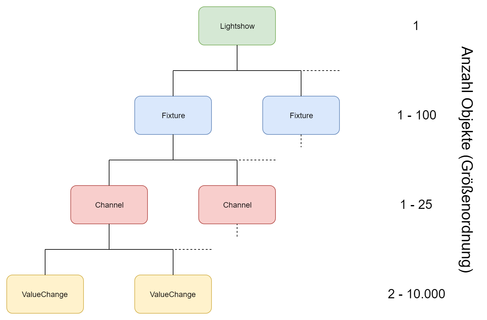
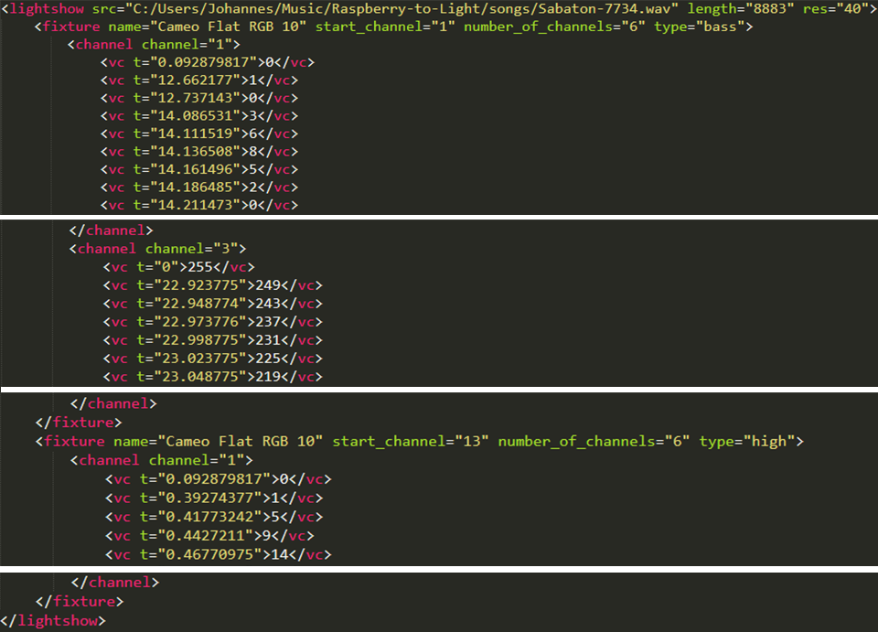

# 3.5.1 Klassen rund um eine Lightshow

## Lightshow
Eine Lightshow besteht aus
* der Angabe ihrer zugehörigen Sounddatei
* ihrer Länge in Sekunden * Änderungen pro Sekunde + 3
* ihrem höchsten verwendeten DMX-Channel
* einem Vector mit all ihren Fixtures

## Fixture
Ein Fixture besteht aus
* seinem DMX-Start-Channel
* seinem Namen
* seinem Typen (z.B. Bass, Action, ...)
* der Anzahl seiner Channel
* den Angaben, der wievielte Channel die Channel für den Dimmer sowie die Farben Rot, Grün und Blau innerhalb des Fixtures sind
* einem Vector mit all seinen Channels

## Channel
Ein Channel besteht aus
* seinem Channel innerhalb eines Fixtures
* einem Vector mit all seinen ValueChanges

## ValueChange
Ein ValueChange besteht aus
* seinem Zeitpunkt
* einem Wert zwischen 0 und 255.

# 3.5.2 Generierung einer Lightshow
Für eine Lightshow müssen Fixtures angelegt werden. Diese können den Typen Bass, Middle, High oder Ambient haben. Jedes Fixture besitzt Channel, die zum Beispiel die Farbe Grün oder ein globaler Dimmer sein können. Lampen des Typen Bass stellen die Energie-Veränderungen innerhalb eines Songs im Frequenzbereich zwischen 20 Hz und 50 Hz dar. Middle entspricht dem Bereich zwischen 100 Hz und 600 Hz, High dem Bereich zwischen 600 Hz und 2000 Hz. Ambient-Lampen stellen keine Veränderungen dar sondern bleiben gleich hell. Die ValueChanges für jeden Typen werden aus der Analyse genommen.

Bei Fixtures, die einen globalen Dimmer haben, kann die anzuzeigende Farbe gemischt und können die Energie-Veränderungen auf den Dimmer gelegt werden. Fixtures, die keinen globalen Dimmer haben sind dadurch innerhalb unserer Anwendung auf die Farben begrenzt, die sie als einzelne Channel selber darstellen können (meistens rot, grün, blau). Bei ihnen werden die Änderungen direkt auf einen der Farb-Channel gelegt.

Da die Änderungen der Lampenhelligkeit viel zu stark geschwankt hat wurden die aus der Analyse verwendeten Werte geglättet. Die Werte für den Bass nur ein bisschen, die Höhen-Werte etwas mehr und die Middle-Werte am stärksten.

Ebenfalls aus der Analyse kommt eine Segmentierung des Liedes. Bei jedem Segmentwechsel wird ein Farbwechsel mit variabel langem Fade eingefügt. Aufgrund der Anforderung, dass eine zweimal für den selben Song generierte Lightshow exakt gleich aussehen muss wurden für alle Fixture-Type Farbpaletten vordefiniert. Diese werden durchlaufen, wodurch nie zwei unterschiedliche Fixture-Typen gleichzeitig die gleiche Farbe haben.

Am Ende werden die Fixtures einem Lightshow-Objekt hinzugefügt. Nach der Generierung wird die Lightshow dann für ihren Song in der LightshowRegistry registriert.

# 3.5.3 Persistierung von Lightshows
Die Klasse LightshowRegistry dient dazu, eine Verbindung zwischen Songs und deren Lightshows herzustellen. Dafür enthält sie eine Map mit Songs als Key und Lightshows als Value. Songs und Lightshows werden in dieser Map allerdings nicht in Objektform repräsentiert, sondern ein Key ist der Name der Song-Datei und der Value ist der absolute Pfad inklusive Dateiname der Lightshow-XML-Datei.

Dafür existieren im von der Anwendung erstellten Raspberry-to-Light-Ordner zwei Unterordner: songs und xml-lightshows. Jeder hinzugefügte Song wird in den Ordner songs kopiert. Dadurch können Lieder von einem USB-Stick zur Anwendung hinzugefügt und der Stick im Anschluss wieder entfernt werden. Die Lightshows werden in XML-Dateien im Ordner xml-lightshows geschrieben. Dies geschieht mit Hilfe der Bibliothek tinyxml2. Dabei wird die Struktur der Objekte innerhalb eines Lightshow-Objekts beibehalten: Root-Element in einer XML-Datei ist immer \<lightshow\>. Darunter befinden sich verschachtelt entsprechend eine variable Anzahl von \<fixture\>, \<channel\> sowie \<vc\> (ValueChange).

* \<lightshow\> beinhaltet den Pfad zur Sound-Datei, auf die sich diese Lightshow bezieht, die Länge (Länge in Sekunden * Änderungen pro Sekunde + 3) und die Auflösung der Lightshow, also die Anzahl der Änderungen pro Sekunde.
* Jedes \<fixture\> beinhaltet seinen Namen, seinen Start-Channel, die Anzahl seiner Channel sowie seinen Typen.
* Jeder \<channel\> beinhaltet seinen Channel innerhalb seines Fixtures.
* Jeder \<vc\> beinhaltet seinen Zeitpunkt in Sekunden als Attribut und seinen Wert (0-255) als Text.

Durch die menschenlesbare und leicht editierbare Persistierung können mit geringem Aufwand händische Änderungen an generierten Lightshows vorgenommen werden.

# 3.5.4 Abspielen einer Lightshow
Wenn ein Lied samt Lightshow abgespielt werden soll, wird in der LightshowRegistry für den aktuellen Song die entsprechende Lightshow-Datei herausgesucht. Diese wird dann eingelesen und dabei die hierarchische Struktur aus Objekten wieder hergestellt. Dann wird aus der hierarchischen Anordnung der Objekte eine zeitliche Anordnung aller ValueChanges erstellt. Dafür wird ein 2D-Vector der Länge "Länge des Liedes in Sekunden * Änderungen pro Sekunden + 3" erstellt. Jedes Element ist wiederum ein Vector mit 512 Elementen. Diese stellen die 512 DMX-Channel dar und jeder ValueChange wird an der zeitlich richtigen Stelle in den entsprechenden Channel eingetragen.

Nun wird zwischen zwei Fällen unterschieden: Auf allen getesteten Geräten außer dem Raspberry Pi funktioniert der QMediaPlayer problemlos (Windows, Linux und macOS). Da bei diesem der aktuelle Zeitpunkt des spielenden Liedes auf Millisekunden genau abgefragt werden kann ist das synchrone Abspielen von Licht und Ton gut möglich. Dazu wird eine Signal-Verbindung zum QMediaPlayer hergestellt, die alle abgespielten 5 ms eine Methode aufruft. In dieser wird die aktuelle Position durch 25 geteilt, da alle 25 ms der nächste Frame der Lightshow abgespielt werden muss. Dann wird aus dem vorher vorbereiteten 2D-Vector das richtige Element mit den 512 Channel-Werten an das aktuell aktive DMX-Device gesendet.

Für den Raspberry Pi musste von einem anderen Projektteilnehmer eine Implementierung von PortAudio programmiert werden. Diese bietet im Gegensatz zu QMediaPlayer nicht die Möglichkeit, auf Millisekunden genau den aktuellen Zeitpunkt des spielenden Liedes abzufragen. Deshalb kommt hier ein eher ungenaues Timing zum Einsatz: Mit der Methode usleep(ms) wird der aktuelle Thread für die übergebene Anzahl an Millisekunden pausiert. Dieser Aufruf findet innerhalb einer for-Schleife statt, die den vorher erstellten 2D-Vector durchläuft, die aktuellen Universe-Werte zum DMX-Device sendet und dann circa 25 Millisekunden schläft. Innerhalb der Schleife wird auch überprüft, ob das Lied gerade pausiert oder beendet wurde. Da usleep() nie exakt die übergebene Zeitspanne schläft war es eine Fleißarbeit, einen annähernd richtigen Wert herauszufinden. Da sich die Lightshow im Laufe des Liedes immer weiter vor bzw. hinter den Sound verschiebt mussten Lieder immer mehrere Minuten am Stück abgespielt werden, um dann zu gucken, ob die Lightshow immer noch ungefähr synchron ist oder nicht,

# 3.5.5 Kommunikation zwischen Anwendung und DMX-Device
Diese Anwendung funktioniert mit drei verschiedenen DMX-Devices: Velleman K8062, Eurolite Pro Mk2 und Eurolite Pro Cable Version. Dabei unterscheidet sich das K8062 von den beiden Eurolite-Geräten sowohl hinsichtlich der Art der Kommunikation als auch in der Übertragungsrate (und entsprechend der sinnvollen Einsetzbarkeit).

Zunächst stand nur das K8062 zur Verfügung. Bei der Umsetzung der Kommunikation wurde hier eine von Velleman veröffentlichte Test-Anwendung als Vorlage genommen. In der Test-Anwendung wird ein separater Prozess gestartet, der durchgehend einen Shared Memory ausliest und diesen über USB an das K8062 schickt. Aufgrund der Vorgabe, dass kein zweiter Prozess gestartet werden darf wird dies in unserer Anwendung mit einem Thread gelöst. Die von Velleman veröffentlichten Dateien eigneten sich auch nur zur Nutzung unter Windows. Unter Zuhilfenahme von durch andere Programmierer veröffentlichte Code-Schnipsel wurde unsere Lösung so programmiert, dass sie unabhängig vom Betriebssystem ist und somit unter Windows, Linux und macOS funktioniert.

Wenn ein Lied mit seiner Lightshow abgespielt werden soll wird ein Thread gestartet. Diesem werden eine Referenz auf einen std::vector mit 512 Integern und eine Referenz auf eine bool lightshow_playing übergeben. Solange die Variable lightshow_playing true ist schickt die Methode in dem Thread durchgehend den Inhalt des Vectors mit Hilfe der Bibliothek libusb an das K8062. Sobald lightshow_playing vom Hauptthread aus auf false gesetzt wird beendet der Thread seine Übertragung und damit sich selbst.

Problematisch ist dabei die langsame USB-Geschwindigkeit des im K8062 verbauten Chip. Dieser kann nur USB-Pakete der Größe 8 Byte annehmen, von denen nur 6 Bytes die eigentliche Nutzlast beinhalten. Das macht das K8062 in der Kombination mit mehr als drei Lampen unbrauchbar. Unsere Lightshows werden wie oben genannt für eine Frequenz von 40 Hz generiert. Sollte ein ganzes DMX-Universe an Lampen angelegt sein, wären pro Frame ~85 USB-Übertragungen notwendig. Das entspricht 3.400 USB-Übertragungen pro Sekunde. Alleine für die ~85 USB-Pakete wird mehr als eine Sekunde benötigt, obwohl pro Frame eigentlich nur 25 ms zur Verfügung stehen. Die visuelle Darstellung der Lightshow mit dem K8062 und vielen Lampen ist also vollkommen verzerrt, falsch und unbrauchbar.

Zur Problemlösung wurden alternative DMX-Interfaces von Eurolite beschafft. Diese können USB-Pakete der Größe 64 Byte verarbeiten und USB-Pakete von bis zu 1.024 Byte annehmen. Alles was über die 64 Byte hinaus geht wird intern als neues Paket behandelt. Dies ermöglicht eine einzelne Übertragung des gesamten DMX-Universes, statt es wie beim K8062 händisch in viele kleine Pakete aufteilen zu müssen. Da es nicht viel Beispiel-Code zu diesen Geräten gibt und sich der Aufbau der nötigen USB-Pakete grundlegend vom Aufbau beim K8062 unterscheidet hat sich die Einbindung in die Anwendung lange hingezogen. Nun funktionieren sie ebenfalls mit libusb und unter Windows, Linux sowie macOS. Stand jetzt gibt es aber noch ein Problem der Paketübertragungen auf dem Raspberry Pi, sodass auf ihm nur das K8062 verwendet werden kann.

## 3.5.6 Implementierung von Portaudio

Im Gegensatz zu der Qt Multimedia Library ist Portaudio eine Low Level Audio Library. Das bedeutet, Portaudio stellt keine Möglichkeit zur Verfügung, einfach einen Dateipfad zu einer Audiodatei anzugeben und diese dann abzuspielen. Portaudio bietet lediglich die Möglichkeit, Audiosamples aus einem Array auf der Soundkarte wiederzugeben. Wie die Samples in dieses Array kommen, ist Aufgabe des Nutzers der Library. Zusätzlich benötigen wir für den `PortaudioSongPlayer` noch Funktionalitäten wie Start / Stop / Pause. Eine Playlist Funktionalität wird nicht benötigt, sie wird von `MusicPlayer` zur Verfügung gestellt, der dann eine Implementierung von `SongPlayer` steuert.

Da wir für die Analyse immer Wav-Dateien verwenden und andere Formate gegebenenfalls vorher zu Wav konvertieren, wurde im `PortAudioSongPlayer` nur für den Support von Wav-Dateien implementiert. Anfangs wurde noch für den Raspberry Pi 3 B+ entwickelt. Aus diesem Grund wird, um Resourcen zu schonen, der Song, der abgespielt wird, immer nur stückweise eingelesen. So wird der begrenzte Arbeitsspeicher des Raspberry Pi nicht unnötig belastet. 
