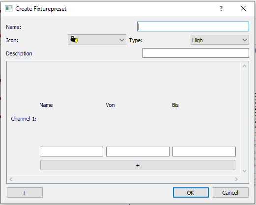

## 3.6.1 Übersicht
### Allgemeines
Die GUI basiert auf dem [QtWidgets Modul](https://doc.qt.io/qt-5/qtwidgets-index.html). Dieses stellt das [MainWindow](#mainwindow) zur Verfügung. Das MainWindow ist wie der Name sagt, als hauptsächliches Anwendugsfenster gedacht. Deswegen sollten dort einige Funktionen verankert werden. Aktuell ist die MainWindow-Klasse im Hinblick auf objektorientierte Programmierung sehr schlecht Umgesetzt. Die Gründe dafür sind vor allem auf die die C++, Qt Framework und Software Architektur Kenntnisse zurückzuführen, die zum Zeitpunkt des Erstellens von Großteilen der MainWindow-Klasse im geringen Maße vorhanden waren.  
**Bei Weiterführung des Projektes wäre es Sinnvoll die MainWindow-Klasse in mehrere Klassen aufzuteilen.**

### Designentscheidungen
Die Standardgröße und Breite wurde an das maximale Maß des offiziellen Raspberry Pi Bildschirms angepasst. Mit 800 x 480 füllt es den Bildschirm komplett aus. Um das Anpassen der Größe zu vereinfachen, wurde neben den Menüpunkten unter View noch das Shortcut "F11" zum Wechseln zwischen "Fullscreen" und Maximiert implementiert.

### Programmordner
Wir nutzen einen Ordner um Songs, Lightshows, Playlists, Fixture Presets und die aktuellen Fixtures zu speichern. Der Ordner wird unter Windows im Musik-Verzeichnis und unter Unixsystemen direkt im Home-Verzeichnis erstellt. Das war nötig, da es unter Linux Probleme gab die Dateien in dem Ordner zu verändern.

## 3.6.2 MainWindow
Zu Beginn des Projektes wurde der [QtDesigner](https://doc.qt.io/qt-5/qtdesigner-manual.html) genutzt, woraus große Teile des MainWindow über eine .ui-Datei geregelt werden. Der QtDesigner ist ein Tool der Qt eigenen Entwicklungsumgebung [QtCreator](https://doc.qt.io/qtcreator/index.html).
Es ist jedoch auch möglich, alle Funktionen des QtDesigner mit C++ Code zu lösen, sodass aus Lesbarkeitsgründen auf C++-Code umgestellt wurde.

Das MainWindow hat folgendes Layout:


   
aus Dokumentation des [QMainWindow](https://doc.qt.io/qt-5/qmainwindow.html)

In der Raspberry to Light Gui wird von diesem Layout die Menu Bar, die Toolbar, das Central Widget, sowie die Status Bar genutzt.
Der Dock Widgets Bereich ist nicht genutzt. Bei Weiterführung des Projektes könnten Dock Widgets die GUI noch aufwerten. Desweiteren wird als central Widget ein [StackedWidget](#stacked-widget) verwendet, wodurch das Umschalten der verschiedenen Ansichten geregelt wird. Es gab mehrmals die Überlegung, aus ästhetischen Gründen, dem verwendeten StackedWidget ein [TabWidget](https://doc.qt.io/qt-5/qtabwidget.html) vorzuziehen. Jedoch ist der Vorteil eines stackedWidget gegenüber einem TabWidget, dass bei einem stackedWidget mit [Signalen und Slots][qt-Signals] von Knöpfen oder [Actions](4. Quellen & Ressourcen#qaction-klasse) gearbeitet werden kann. Somit kann in dem entsprechenden Slot dieser, weitere Änderungen an der Ansicht, wie z.B. der Toolbar, vorgenommen werden (siehe Zeile 3).
```C++
void MainWindow::on_action_fixture_management_triggered() {
  ui->stackedWidget->setCurrentIndex(3);
  hide_edit_tools();
}
```
Zukünftig könnte eine Umstellung vermutlich möglich sein, jedoch lag der Focus bisher auf anderen Dingen.

### Struktur des MainWindow

In dem stackedWidget sind 4 Widgets enthalten:
- Willkommen-Seite, welche einen schönen Einstieg in das Programm bieten soll
- [Fixture Management](#fixture-management), welche zur Verwaltung der angesteuerten Fixtures dient
- [Player View](#player-view), die einen groben Überblick über die Lightshows geben soll
- [Playlist View](#playlist-view), die alle Songs in der Playlist tabellarisch darstellt


## 3.6.3 Fixture Management
### Buttons
Im Fixture Management Widget sieht man im oberen Bereich vier Buttons. Diese sind [1] "Fixture hinzufügen", [2] "Neues Fixture erstellen", [3] "Fixture editieren", [4] "Löschen".


Der Button "Fixture hinzufügen" öffnet einen Dialog, in welchem man das Preset, den Typen und eine freie Startadresse auswählen kann. Wird eine andere Startadresse als die Vorgegebene
gewählt, so wird beim Klicken auf "+" geprüft, ob diese Adresse, so wie jede weitere Benötigte, frei ist. Wenn ein blockierter Bereich gewählt wurde, erscheint um den Start Channel ein roter Rahmen und das Fixture wird nicht hinzugefügt. Wenn alle Angaben fehlerfrei sind, wird das Fixture zu dem Universum hinzugefügt. Sollte noch kein Fixture vom gewähltem Typen
existieren, wird dieser Typ und das passende Fixture angelegt.


Mit dem Button "Neues Fixture erstellen" kann man komplett neue Presets von Fixtures erzeugen. Eine große Schwierigkeit waren die modularen Channel und Funktionen, da der "+" Button
immer zum richtigen Channel eine neue Funktion des Fixtures hinzufügen muss. Hierzu wurde ein [QSignalmapper](https://doc.qt.io/qt-5/qsignalmapper.html) genutzt. Mit diesem kann man das Elternelement (den Channel) der Funktion zuweisen, welche eine neue Zeile erzeugt.
```c++
QSignalMapper *signalMapper = new QSignalMapper(this);
signalMapper->setMapping(btn_new_function, btn_new_function_parent);
connect(btn_new_function, SIGNAL(clicked()), signalMapper, SLOT(map()));
connect(signalMapper, SIGNAL(mapped(QObject *)), this, SLOT(on_pB_add_function_generated_clicked(QObject *)));
```
Name und Description sind Pflichtfelder und werden, bei nicht Ausfüllen, rot umrandet.



Durch Drücken des "Fixture editieren" Knopfes, öffnet sich ein neues Fenster mit den Daten des gewählten Fixtures. Dieses baut auf dem "Neues Fixture erstellen"-Fenster auf, hat allerdings
die zusätzliche Funktion, dass der Startchannel eingestellt werden kann. Auch hier wird überprüft, ob der gewählte Startchannel, so wie die darauf folgenden Benötigten, zur Verfügung steht. Um Funktionen oder Channels zu löschen, müssen die Felder freigelassen werden.


Der "Löschen" Button entfernt Fixtures ohne Nachfrage. Wenn man einen Typen ausgewählt hat und diesen löschen möchte, wird man einmal gefragt, ob man den Typen und alle seine Fixtures löschen möchte.

Sobald ein Fixture hinzugefügt, verändert oder gelöscht wird, speichert das Programm die Änderungen in eine XML-Datei.

### Fixture Anzeigebereich
Der mittlere Bereich wird in zwei geteilt. Auf der linken Seite gibt es ein [QTreeWidget](https://doc.qt.io/qt-5/qtreewidget.html), welches das Universum beinhaltet. Das Universum hat als direkte Unterelemente Typen. Die Fixtures werden ducrch diese Typen eingeordnet. Fixtures werden mit ihrem Icon, Namen und den Adressierbaren Kanälen angezeigt. Hier ist es möglich Fixtures per Drag an Drop innerhalb des Typen zu Verschieben oder durch Ziehen in einen anderen Typen, den Typen des Fixture zu verändern.

Auf der rechten Seite werden, sobald ein Fixture aus der linken Liste ausgewählt wurde, Informationen über dieses Fixture angezeigt. Dazu wurde ein [QTextEdit](https://doc.qt.io/qt-5/qtextedit.html) benutzt. Hier ist die Beschreibung, der Typ
und die Funktionen zu sehen. Die Funktionen sind nach den einzelnen Kanälen aufgeteilt. Es ist aufgeführt, mit welcher DMX-Adresse man welche Funktion, mit welchem Wert ansteuern kann.


Unter dem Menüpunkt Edit gibt es die [Action][qaction] "Edit Fixture Presets". Hier hat man die Möglichkeit Presets komplett zu entfernen oder zu verändern. Veränderte oder gelöschte Presets haben keine Auswirkung auf bereits in der Liste befindliche Fixtures.


Presets und Fixtures können über den Menüpunkt "File" und dessen Unterpunkte "Load file with fixturepreset" und "Load Fixtures" geladen werden.

## 3.6.4 Player View
Für die Player View gab es verschiedene Auswahlmöglichkeiten diese umzusetzen:
- [Qt Quick1](https://doc.qt.io/qt-5/qtquickcontrols1-index.html)
- [Qt Quick2](https://doc.qt.io/archives/qt-5.11/qtquickcontrols2-index.html)
- [QGraphics View Framework](https://doc.qt.io/qt-5/graphicsview.html)

Qt Quick1 wird nicht unbedingt als besser empfunden, als das QGraphics View Framework oder dem Nachfolger Qt Quick2.
Deswegen fiel dies aus der Auswahl.
Qt Quick2 ist basiert auf der Qt eigenen Scriptsprache QML und wird aktuell als effizienter und besser als das QGraphics View Framework angesehen (siehe https://www.qt.io/blog/2017/01/19/should-you-be-using-qgraphicsview). Jedoch hatte es zwei große Nachteile gegenüber dem verwendeten Graphics Framework.
Zum einen wäre es notwendig gewesen, während der Einarbeitung in C++, sich in eine weiter Programmiersprache einzuarbeiten, zum anderen ist nicht mal bekannt inwieweit QML auf einem Rassberry Pi funktionert.
Da eine der Informationquellen für das Programm QLC+ vorgeschlaggen wurde, welches für den Rasberry Pi unterstützt wird, und dieses auch mit dem Qt Graphics Framwork arbeitet.
Aufgrund dessen fiel die Entscheidung, trotz der vermeintlichen Ineffizenz des Qt Graphics Frameworks, auf letzteres.

Die Player View bietet Verwaltungsfunktionen, ein scrollbares Ansichtsfenster und ein Widget für das Objekt [Multiple tracks](#multiple-tracks). Das Objekt der MultipleTracks-Klasse ist eine [QGraphicsScene][qgraphicsscene], welche als eine Art Container für [QGraphicsItems][qgraphicsitems] agiert.

Ursprünglich gab einen Zwischenspeicherung für jede einzelne QGraphicsScene zu einem Song. Aufgrund von Perfomance wird das MultipleTracks-Objekt beim umschalten nun jedes mal neu erstellt.

### Entwicklung der Player View
Zu Anfangs war für die Player View die Darstellung einer Waveform des zur Lightshow passenden Songs vorgesehen. Desweiteren war die Idee zu jedem Kanal eines Fixtures eine unabhängige Darstellung zu bieten, sodass eine paralelle Zuordnung des aktuellen Zeitpunkts im Song, dem dargestellten Ausschlag der Waveform und jedes Kanals der Fixtures möglich wäre.


Die Idee der Waveform wurde aufgrund ihrer Komplexität und dem zeitlich damit verbundenen Aufwand verworfen. Die einzelne Darstellung der Kanäle wurde aufgegeben, da diese einen großen Aufwand für relativ wenige Informationen schaffen würde und kein vernünftiger Sinn an dieser Form der Darstellung gesehen wurde, gerade in Bezug auf Kanäle, die nicht zur Steuerung der Farbe vorgesehen sind, wie zum Beispiel ein Kanal für ein Stroboskop.

Die nächste Idee war, die Farbe des Fixtures, auf den Objekten darzustellen, die Anzeigen, wann eine Lampe an bzw. aus ist. Diese Variante wurde verworfen, denn es ist möglich, dass eine Lampe ein oder mehrere Farbwechsel, während einem Leuchtzeitraum, hat. Somit müsste ein einzelnes Standard Lightshow-Objekt einen Farbverlauf darstellen können. Dies ist nach aktuellen Kenntnisstand mit dem [QGraphics View Framework](https://doc.qt.io/qt-5/graphicsview.html) nicht möglich. Aufgrund von vielen Problemen an anderen Stellen, der Zeit und der Komplexität Lightshows editieren zu können, wurde diese Funktion eingestellt und die Player View auf die aktuelle Variante reduziert. Diese zeigt nur an, wann ein Fixture in Abhängigkeit des Songs leuchtet.


### Aussehen Multiple Tracks-Scene  
Die Multiple Tracks-Szene besteht aus:
- einem SongLabel-Objekt, welches den Interpret und den Title des Songs angibt, dessen Lightshow gerade dargestellt wird:  


- einem HeaderMultTracks-Objekt in Länge des Songs, dessen Lightshow gerade dargestellt wird, der im Prinzip eine Zeitleiste darstellt:

:  


- vielen [StandardLightshow-Objekten](#standardlightshow):  


- einem MusicSlider, der in der der View des gespielten Songs, die Sekundenposition anzeigt:


- einigen "Dividern", welche einerseits die einzelnen Fixturespuren trennen, sodass ein übersichtlicherer Eindruck entsteht, und andererseits mit einer Aktion in der Toolbar ein Gitter bilden können, um Zeitpunkte innerhalb der View besser ablesen zu können.  


### Lightshow Fixture Properties
Die Lightshow Fixture Properties-Objekte symbolisieren die im [Fixture Management](#fixture-management) eingestellten Fixtures. Wie bereits im Abschnitt [Player View](#player-view) dargestellt, war die Player View als Player Edit View angedacht, in der man auch die bereits berechneten Lightshows noch einmal überarbeiten konnte. Für diesen Fall und für weitere Ideen wie die Darstellung der verschiedenen DMX-Kanäle eines einzelnen Fixtures waren diese Objekte vorgesehn. In der aktuellen Version der R.t.L. GUI haben diese nur noch die Funktion die einzelnen Fixtures ohne eine Kanalanzeige darzustellen.

### Change Lightshow Dialog
Der ChangeLightShowDialog sollte die Funktionen bieten Lightshows zu bearbeiten. Dieser wurde aufgerufen mit einem [Signal][qt-signals], welches nach Doppeltklicken auf ein StandardLightshow-Objekt eines Fixtures emittiert wurde.

**Die Klasse Change Lightshow Dialog ist für zukünftige Nutzungen bzw. Implementierungen der Edit-Funktionen im Projekt verblieben. Sie ist allerdings aktuell ungenutzt**


### Umschalten und Hinzufügen der Playerview
Das Umschalten und Hinzufügen der PlayerView funktionieren sehr ähnlich. Da das Umschalten ein wenig komplexer ist, als das Hinzufügen, wird im Anschluss nur das Umschalten behandelt.

 Das Umschalten der PlayerView wird mit Hilfe einer [QCombobox](https://doc.qt.io/qt-5/qcombobox.html) und [Qt Signals und Slots][qt-signals] ermöglicht. Die QCombobox unterliegt der [Qt Model/View Architechture][qmodel-view], sodass es möglich ist anhand dieselben Indices der Playlist als Indices für die QCombobox zu verwenden.  
Wenn die Anzeige dieser geändert wird, emittiert die ComboBox ein Signals, dass sich der aktuell angezeigte Index ändert. Anhand des Indexes, den das Signal geliefert hat, lässt sich ein Song-Objekt aus der Playlist heraussuchen und mit diesem Song Objekt kann eine Lightshow von der [LightShowRegistry](#lightShowRegistry) angefordert werden.

**Hier ist wichtig, darauf zu achten, dass das Signal, welches den MusicSlider zum bewegen bringt, abhängig von der Szene disconnected wird. Wie im Abschnitt [Initialisieren MultipleTracks-Szene](#initialisieren-multipletracks-szene) erwähnt, wird das MusicSlider Objekt nur erstellt, falls die anzuzeigende Szene vom aktuell abgespielten Song ist. Wenn das Signal nicht disconnected wird, und das Objekt nicht existiert, stürtzt das Programm ab.**

```c++
void MainWindow::change_player_edit_view(int index) {
  has_fixture_changed();
  disconnect(player, &MusicPlayer::position_changed, player_edit_view, &Player_edit_view::make_music_slider_move);

  Song *song = player->get_playlist_media_at(index)->get_song();
  QString label = QString::fromStdString(song->get_artist()) + " - " + QString::fromStdString(song->get_title());

  if (player->get_playlist_media_at(index)->get_lightshow_status()) {
    if (player->get_current_song()->get_file_path()
        == player->get_playlist_media_at(index)->get_song()->get_file_path()) {
      std::shared_ptr<Lightshow> ls = lightShowRegistry.get_lightshow(song);

      player_edit_view->change_scene(true, label, ls);

      connect(player, &MusicPlayer::position_changed, player_edit_view, &Player_edit_view::make_music_slider_move);
    } else {
        std::shared_ptr<Lightshow> ls = lightShowRegistry.get_lightshow(song);
        player_edit_view->change_scene(false, label, ls);

    }
  } else {
    player_edit_view->init_waiting_or_dmx_not_connected_scene(true);
  }
}

```
### Initialisieren MultipleTracks-Szene
Eine Multiple-Tracks-Szene wird anhand dreier Parameter initialisiert:
- einer boolean-Variable, ob die angezeigte Szene, die des aktuell abgespielten Songs ist
 - sie wird dazu genutzt um zu Entscheiden, ob der MusicSlider in die Szene eingefügt werden muss, oder nicht
- einem String, in dem der Interpret und der Titel des Songs, der zur Szene gehört, übergeben wird
  - es wäre möglich gewesen auch das Song-Objekt zu übergeben, allerdings muss die MultipleTracks-Klasse nicht die Song-Klasse kennen, nur um Titel und Artist des Songs anzufordern
- einem Lightshow-Pointer von dem die time_value_changes der einzelnen Fixtures abgefragt werden und mit denen die Position bzw. Anzahl der StandardLightshow-Objekte berechnet werden

### Arten eines MultipleTracks-Objekts
Es gibt drei verschiedene Varianten des MultipleTracks-Objekts:
- die default-Szene
  - wird angezeigt, falls noch kein Song in die Playlist geladen wurde
- die waiting-Szene
  - wird angezeigt, wenn ein Song in die Playlist geladen wurde, die Lightshowgenerierung jedoch noch nicht abgeschlossen wurde
- die DMX-Device-not-connected-Szene
  - diese szene, war Ursprünglich dazu gedacht den User dazu aufzufordern, ein DMX-Interface anzuschließen, da ohne dieses keine Lightshows generiert wurden
  - diese ist obsolet geworden, da Lightshows mittlerweile immer generiert werden
 - die eigentliche [MultipleTracks-Szene](#aussehen-multipletracks-szene)
  - wird angezeigt, wenn ein Song in die Playlist geladen wurde und seine Lightshow generiert wurde


## 3.6.5 Playlist View

Die Playlist View ist ein Objekt der Klasse Playlist View, welche eine Subklasse der Klasse [QTableView][qtableview] ist. Diese ist Teil der [Qt Model/View Architechture][qmodel-view].
Wie der Name der Klasse vermuten lässt wird diese Tabelle als Playlist-Ansicht verwendet.
Es wäre möglich gewesen ein QTableWidget zu verwenden (dies wäre ein vordefiniertes Widget der [Qt Model/View Architechture][qmodel-view] gewesen),
jedoch ist die Nutzung einer View mit einem selbst erstellten Model am flexibelsten, da ein
QTableWidget keine Änderungen am Model, an den [Signalen und Slots][qt-signals] usw. zulässt,
da ein QTableWidget mit einem Model verankert geliefert wird. Eine QTableView separiert die View vom Model, sodass oben genannte Änderungen vorgenommen werden können.   

Eine QTableView kann vier verschiedene Models darstellen:
> * QStringListModel is used to store a simple list of QString items.
* QStandardItemModel manages more complex tree structures of items, each of which can contain arbitrary data.
* QFileSystemModel provides information about files and directories in the local filing system.
* QSqlQueryModel, QSqlTableModel, and QSqlRelationalTableModel are used to access databases using model/view conventions    

aus [Model/View Programming][qmodel-view]

Da nicht nur Strings, keine files oder SqlTabellen dargestellt werden sollen, wird in der R.t.L. Anwendung ein [QStandardItemModel][qstandarditemmodel] als Superklasse für die Klasse PlaylistViewModel verwendet. In einem QStandardItemModel werden [QStandardItem][qstandardItem] verwaltet. Jede Zelle der Tabelle wird demnach durch ein QStandardItem im Model repräsentiert. dadurch muss beim hinzufügen für jede Zelle ein neues Item erstellt werden. Dies ist besonders wichtig für die [Drag and Drop Funktionalität](#drag-and-drop-funktionalität).

### Ändern des Lightshowstatus in PlaylistView
Das automatische Ändern der Lightshowstatus-Anzeige in der PlaylistView wird durch das Abfangen des entsprechenden [Signals][qt-signals] ausgelöst:
```c++
connect(this, &MainWindow::lightshow_for_song_is_ready,
          this->playlist_view,
          [=](Song *song) { playlist_view->slot_song_lightshow_state_has_changed(
            this->player->playlist_index_for(song)); });
```


Anschließend wird das entsprechende [QStandardItem][qstandarditem] in einer geerbten Methode `setData()` des PlaylistViewModels geändert.   

_Wichtig ist in diesem connect-Befehl zu beachten, dass normalerweise nur Signale und Slots miteinander verbunden werden können, wenn der Slot dieselben oder weniger Parameter hat. Dies sollte im Normalfall auch eingehalten werden, da der Code durch solche "connects", schwerer nachvollziehbar werden kann! Jedoch kann durch diese Variante Informationen über den Sender übergeben werden ([siehe Qt Signals and Slots][qt-signals]) oder eine Verbindung zwischen Signalen und Slots mit unterschiedlichen Parameterlisten hergestellt werden.

#### Drag and Drop Funktionalität
Eine [QTableView][qtableview] und ein [QStandardItemModel][qstandarditemmodel] mit [QStandardItems][qstandarditem] bringen die Drag and Drop Funktiopnaltät zu großen Teilen von Qt her mit:

```c++
PlaylistView::PlaylistView(QWidget *parent) : QTableView(parent)
    this->setDropIndicatorShown(true);
    this->setDragDropOverwriteMode(false);
    this->setDragEnabled(true);
    this->viewport()->setAcceptDrops(true);
    this->setDragDropMode(QAbstractItemView::InternalMove);


...

void Playlist_view::add_to_playlist_view(Playlist_item *playlist_item){
  ...
  items.append(new QStandardItem(QString::fromStdString(playlist_item->get_song()->get_title())));
  items.last()->setDropEnabled(false);
  items.last()->setDragEnabled(true);
  ...
}
```

Es traten beim Implementieren der Drag and Drop Funktion mehrere Probleme auf.
Für die Drop-Operation muss im PlaylistViewModel die Methode `dropMimeData` reimplementiert werden. Wenn diese nicht reimplementiert ist, ist es möglich, Zeilen so um Spalten verschoben dropen, dass im besten Fall nur um eine Spalte verschoben sind und im schlimmsten sie teilweise andere Zellen löschen, sich duplizieren o.ä.:


Der einzige Unterschied zur "dropMimeData"-Methode des QStandardItemModels ist das Ignorieren der Spaltenposition des Drops. Dieser wird einfach auf 0 gesetzt, wodurch das falsche Spaltenverschiebe-Verhalten vermieden wird.
```c++
bool PlaylistViewModel::dropMimeData(const QMimeData *data, Qt::DropAction action, int row, int column, const QModelIndex &parent)
{
    Q_UNUSED(column);
    return QStandardItemModel::dropMimeData(data, action, row, 0, parent);
}
```

Eines weiteres Problem beim Umsetzen des Umordnens der PlaylistView mit Drag and Drop ist, die alten sowie die neuen Indices der Reihen feststellen zu können, die gedraged wurden. Denn die Reihenfolge in der Playlist sowie in der QCombobox in der Toolbar (siehe [PlayerEditView][#playereditview]) muss auch dementsprechend angepasst werden.
Da es keine bisher keine bekannte Alternative gab, werden zwei Signale des Models genutzt.

```c++
connect(this->model(), &QAbstractItemModel::rowsRemoved, this, &Playlist_view::slot_rows_removed);
connect(this->model(), &QAbstractItemModel::rowsInserted, this, &Playlist_view::slot_rows_inserted);

```
Diese Signale müssen genutzt werden, da eine Drag-Operation innerhalb eines [QStandardItemModels][qstandarditemmodel] nicht als Verschiebe-Operation, sodern als Einfügen und Entfernen von Zeilen umgesetzt wird. In den Slots dieser [Signale][qt-signals] werden die Indices der Eingefügten bzw. Entfernten Reihen gespeichert.
Dabei tritt die Problematik auf, dass wir auch unter anderen Umständen Zeilen in das [PlaylistViewModel](#playlistviewmodel) einfügen und entfernen. Um diesen Umstand zu umgehen wird das dritte Signal "dataCanged" verwendet. Dafür musste die vorherien Implementierung der Anzeige der Playlistindices geändert werden, denn die Indices waren als Daten im Model in der linken Spalte und nicht als Header der View implementiert.
Das Ändern der Indicedaten in der linken Spalte hätte das "dataChanged" Signal emittiert. Um dies zu Umgehen werden die Indices nun als vertikale Header angezeigt. Dies hat den weiteren Vorteil, dass die Änderung der Indices, die Auftritt beim Drag and Drop, sowie beimn löschen eines Songs, vom Qt Framework übernommen wird.

Beim einer Drag-Operation in einem [QStandardItemModel][qstandarditemmodel] werden die Indices der im Model vorhandenen QStandardItems geändert, sodass das dataChanged-Signal emittiert wird.
Da nun nur Änderungen durch eine Drag-Operation  an den QStandardItems des [PlaylistViewModels](#playlistviewmodel) entstehen kann **(solange die PlaylistView nicht durch code oder User-Eingaben verändert wird)**, kann dieses Signal verwendet werden.
Mithilfe einer boolean Variable wird dann in der Methode "slot_rows_removed" entschieden ob eine Drag-Operation ausgeführt wurde und ein passendes Signal ausgesendet wird.

```C++
if(is_drag_drop){
    emit this->playlist_order_has_been_changed(rows_removed_first_index, rows_removed_last_index, rows_inserted_first_index, rows_inserted_last_index);
    is_drag_drop = false;
}
```
### PlaylistViewStyle
Die PlaylistviewStyle-Klasse erbt von [QProxyStyle](https://doc.qt.io/qt-5/qproxystyle.html) und hat nur den Nutzen den in `this->setDropIndicatorShown(true);` eingeschaltenen Dropindikator als eine durchgehende Linie zwischen den Reihen anzuzeigen. Denn der standardmäßige Dropindikator würde als schwarzes Rechteck um eine einzelne Zelle angezeigt werden.  
**Der Code dieser Klasse ist von eine [Stackoverflow-Beitrag](https://stackoverflow.com/questions/7596584/qtreeview-draw-drop-indicator) übernommen!!! Dieser ist ursprünglich für ein QTreeView ausgelegt, jedoch funktioniert dieser auch für QTableViews, da der Style des Dropidicators, im vorliegendem Anwendungsfall ein QTableView-Dropindicator, abhängig vom übergebenen Indicator ist.**

## 3.6.6 Playlist
Zu einem Playlist-Objekt gehört:

- ein Vector von PlaylistItem-Pointern, der als Speicherobjekt der Playlist dient
- Tools für den Zugriff und die Verwaltung des Playlist-vectors
- Tools zum Einlesen und Schreiben von m3u-Playlist-Dateien

**Der einzige Grund, warum die Playlist mit den [PlaylistItems](#playlistitem) in der GUI implementiert wurde, ist, dass für einzelne Funktionen das [Qt Singals und Slots Konzept][qt-signals] genutzt wird und Qt nur in der GUI implementiert ist!**

### Auslesen einer .m3u-Datei
Da eine .m3u-Datei vom Prinzip her eine Textdatei ist, kann man zum auslesen den std::ifstream verwenden.
Es muss nur Zeilenweise ein String ausgelesen werden:
`` while (std::getline(input_file, read_data)) ``
Dieser String read_data wird in den nachfolgenden Zeilen nur mit Hilfe der substr-Methode aufgeteilt in Informationen, die dann in einem [Song-Objekt](#song-objekte) zusammengeführt werden.
Zu beachten sind, die unterschiedlichen Varianten (erweiterte .m3u oder einfache .m3u), sowie weitere Tags wie z.B.
"#EXTVLCOPT". Diese sind eher selten und für Rasberry to Light Anwendungszwecke unwichtig. Deswegen werden diese rausgefiltert.


### Schreiben einer .m3u-Datei
Das schreiben einer .m3u-Datei funktioniert nach demselben Prinzip wie das [Auslesen](#auslesen-einer-.m3u-Datei). Der Unterschied besteht darin, dass ein Outputstream benötigt wird. Der Outputream, der in der Anwendung verwendet wurde, ist ein std::ofstream.  

**Zu Beachten:**  
- Die von der R.t.L. Anwendung geschriebenen .m3u-Dateien sind im erweiterten .m3u Foramt.
- Alle Dateipfade sind absolut und führen zu den Dateien im Raspberry-to-Light-Ordner im Musik-Verzeichnis des Betriebssystems.
- Aufgrund der Formatierung, die innerhalb der Anwendung verwendet wird, ist es nötig die Funktion
``QUrl::fromLocalFile(QString::fromStdString(playlist.at(std::size_t(i))->get_song()->get_file_path())).toString().toStdString()``([QUrl::FromLocalFile](https://doc.qt.io/qt-5/qurl.html#fromLocalFile)) auf den Dateipfad anzuwenden, damit sicher ist, dass Programme, wie der VLC-Player, die Dateipfade innerhalb der R.t.L. generierten .m3u-Datei lesen können.

### PlaylistItem
Die Klasse Playlist-Item ist eine Subklasse der Klasse [QObject][qobject]. Sie dient als eine Art Wrapper-Klasse für Objekte der Klasse [Song](#song-objekte), denn es gab die Möglichkeit in der [PlaylistView](#playlistview) die Titel und Interpreten zu bearbeiten, sodass zumindest die Daten der Playlist, die man speichern kann, korrekt sind.
Dies wurde jedoch, obsolet mit der Implementierung des Auslesens der id3-tags.  
**Der einzige Nutzen von PlaylistItem-Objekten ist, die Möglichkeit zu bieten mit [Qt Signalen][qt-signals] zu arbeiten und den Lightshow-Status eines Songs zu speichern.**

## 3.6.7 Hinzufügen eines Songs

Das Hinzufügen eines oder mehrerer Songs oder m3u-Dateien ist aufgeteilt in mehrere Schritte:

- das erstellen von [Song-Objekten](#song-objekte) aus Dateipfaden
  - aus .mp3-, .wav- oder [-m3u-Dateien](#auslesen-einer-.m3u-Datei)
- Songs, zu denen eine Lightshow generiert werden soll, der [Lightshow-generating-Queue](#lightshow-generating-queue) übergeben
  - wenn eine Lightshow generiert wurde, dem [PlaylistItem](#playlistitem) bescheid geben, damit [PlayerView](#playerview) generiert werden kann
- das [Hinzufügen zur ComboBox](#erstellen)
- das Hinzufügen zur PlaylistView

### Schematischer Vorgang zum Song-Objekte erstellen
Ein Schema der Vorgänge, die dazu führen, dass Song-Objekte aus den Dateipfaden erstellt werden und der [Lightshow-gernerating-Queue] übergeben werden:


Bei diesem Schema ist zu beachten, dass es irrelevant ist, ob der User nur Sounddateien, nur .m3u-Dateien oder eine Mischung aus Sounddateien und .m3u-Dateien auswählt. Desweiteren ist die Anzahl der ausgewählten Dateien unwichtig.
Dies alles ist durch das Zwischenspeichern in Vectoren, nach der Auswahl der Dateien und vor Rückgabe der Song-Objekte, und durch die [Lightshow-generating-Queue](#lightshow-generating-queue), die am Ende des gezeigten Schema ansetzt, möglich.  

### Hinzufügen von Songs zur Combobox und der PlayerView
Durch das vom MusikPlayer emittierten Signal, kann der Combobox, in der Methode `MainWindow::add_player_edit_mode`, einzelnd Stringitems mit Titel und Interpret der jeweiligen Songs hinzugefügt werden.
Es ist wichtig, zu wissen, dass die Combobobx dieselbe Reihenfolge, wie die Playlist haben soll.

### Hinzufügen von Songs zur PlaylistView
Wie im Abschnitt [PlaylistView](#playlistview) bereits erwähnt, ist das PlaylistViewModel ein itembasiertes Model, deswegen muss pro Zelle ein QStandardItem hinzugefügt werden.  

## 3.6.8 Löschen eines Songs
Der wichtigste Punkt, beim Löschen eines Songs aus der Playlist, ist zu beachten, ob der Song, welcher gelöscht werden soll, der aktuell abgespielte Song ist.
Sollte dies der Fall sein, wird erst der Song auf den Nächsten umgeschaltet und danach der entsprechende Song gelöscht.
Dies führte allerdings zu dem Problem, dass die Anwendung abstürtzte, wenn eine Lightshow eines Songs fertig berechnet wurde, dieser Song jedoch schon aus der Playlist gelöscht war.
Dieses Problem ließ sich mit einer Überprüfung vor emittieren des entsprechenden [Signals][qt-signals] vermeiden:
```c++
if(player->playlist_index_for(song) != -1)
    emit lightshow_for_song_is_ready(song);
```

Ein weiteres Problem war das Löschen des letzten Songs. Dabei muss der Song nicht nur aus allen Ansichten und der Playlist entfernt werden, sondern auch aus dem MusicPlayer. Dies war jedoch nicht möglich, ohne das MusicPlayer-Objekt zu zerstören und eine neues zu initialisieren. Um diese Problematik zu umgehen, gibt es nun die Möglichkeit ein "leeres" Song-Objekt an den MusicPlayer zu übergeben.

## 3.6.9 Playlist Reihenfolge verändern
Die Ursprungsidee war es, die Playlistreihenfolge mithilfe von [Aktionen](#aktionen) und dem aktuell Ausgewählten Song in der PlaylistView zu verändern. Jedoch es nur möglich gewesen einzelne Songs zu verschieben. Außerdem ist es nicht sehr Intuitiv die Reihenfolge über einen Button oder eine Action zu verändern. Aufgrund dieser Tatsache wurde die [Drag and Drop-Funktionalität](#drag-and-drop-funktionalität) implementiert.
Mit den alten, sowie neuen Indices, der Reihen, die verschoben wurden, lässt sich dementsprechend sehr einfach die Reihenfolge der Combobox, sowie der Playlist, nach Aufruf durch ein [Signal](qt-signals) verändern.
Dabei wurde das verschieben wie bei der PlaylistView, in der Reihenfolge umgesetzt: Pointer des Objekt vom alten Index holen -> Einfügen dieses Objekts an dem passenden neuen Index -> Objekte an alter Indexposition löschen.

Als Beispiel die Umsetzung für die Playlist:
```c++
int k = new_first_row_index;
for(int i = old_first_row_index; i <= old_last_row_index; i++){
  playlist.insert(playlist.begin() + k, this->playlist_item_at(i));
  k++;
}

for(int i = old_first_row_index; i <= old_last_row_index; i++){
  playlist.erase(playlist.begin() + old_first_row_index);
}
```

## 3.6.10 Songauswahl durch doppelt klicken
Das Song-Auswählen durch doppelt klicken wird umgesetzt durch Abfangen des passenden von der [PlaylistView](#playlistview) ausgesendetem [Signals][qt-signals]:
```c++
connect(playlist_view, &QTableView::doubleClicked, [this](const QModelIndex &index) {
    if (dmx_device.is_connected()) {
      dmx_device.stop_device();
      lightshow_playing = false;
      lightshow_paused = true;
    }
    player->set_media_to(index.row());
  });
```
**Hier ist wichtig zu beachten, dass diese auch die Lightshow angewandt werden sollte!:**  
`if (dmx_device.is_connected()) {
    dmx_device.stop_device();
    lightshow_playing = false;
    lightshow_paused = true;
  }`

In der `set_media_to`- Methode ist wichtig, darauf zu achten, dass der `this->current_playlist_index = index;` auch geändert wird, damit der Player auch gespeichert hat, an welchem Playlistindex, der aktuell gespielte Song ist.

[qt-signals]: https://doc.qt.io/qt-5/signalsandslots.html
[qgraphicsview]: https://doc.qt.io/qt-5/qgraphicsview.html
[qgraphicsitem]: https://doc.qt.io/qt-5/qgraphicsscene.html#details
[qtableview]: https://doc.qt.io/qt-5/qtableview.html
[qstandarditemmodel]: https://doc.qt.io/qt-5/qstandarditemmodel.html
[qstandarditem]: https://doc.qt.io/qt-5/qstandarditem.html
[qmodel-view]: https://doc.qt.io/qt-5/model-view-programming.html
[qobject]: https://doc.qt.io/qt-5/qobject.html
[qaction]: https://doc.qt.io/qt-5/qaction.html